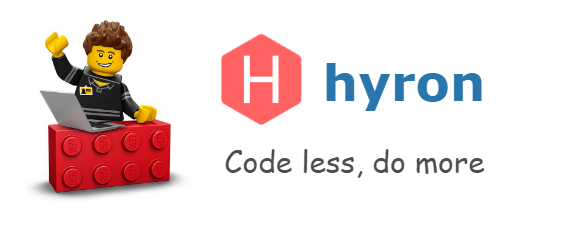

# Overview


We are upgrading the document to make it more accessible to everyone. We are looking forward to receiving suggestions from you to build better materials and products


Hyron focus to 3 main `values`. And that also makes Hyron superior to other frameworks

* High **packability**, increased **plug-in capability**, **Sharing**, and **Reuse**
* **Easy to use**, even for beginner
* **Flexible**, easy to **Customize** and **Expand**, **Versatile**

Follow our [fanpage](https://www.facebook.com/hyron.group/) to update the latest information about Hyron

