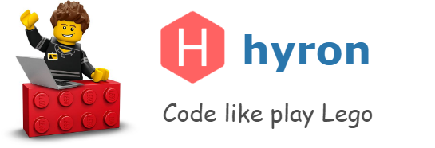

# Overview

## \[ Upgrade \]

We are upgrading the document to make it more accessible to everyone. Sorry about this problem. Hope to serve you soon

Hyron focus to 3 main `values`. And that also makes Hyron superior to other frameworks

* High **packability**, increased **plug-in capability**, **Sharing**, and **Reuse**
* **Easy to use**, even for beginner
* **Flexible**, easy to **Customize** and **Expand**, **Versatile**

Follow our [fanpage](https://www.facebook.com/hyron.group/) to update the latest information about Hyron

## Raw document

Language

* [English](https://github.com/hyron-group/reference/tree/207f58bcaa7c34d8b9e3e4b70fbbaa5b0dfdddbf/en/README.md) 
* [Vietnamese](https://github.com/hyron-group/reference/tree/207f58bcaa7c34d8b9e3e4b70fbbaa5b0dfdddbf/vi/README.md)

