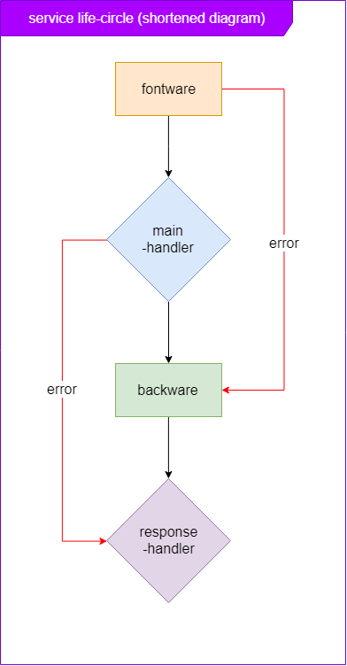

Used to handle response by default

## Features

- Cast other data type (not a string or buffer) into string for response
- Response with error track

# Details

## 1. Cast other data type

The response-handler is a special feature in the hyphen, used to handle the rest of your application, such as data types other than string and bufer (which can be returned by http.ServerResponse), error

As you can see, the response-handler is underneath (purple), which is the last line in the life cycle that data can be returned by a backware. The response-handler will check its return data type, before returning it to the client with res.end

You can also ignore the response-handler with the help of plugins