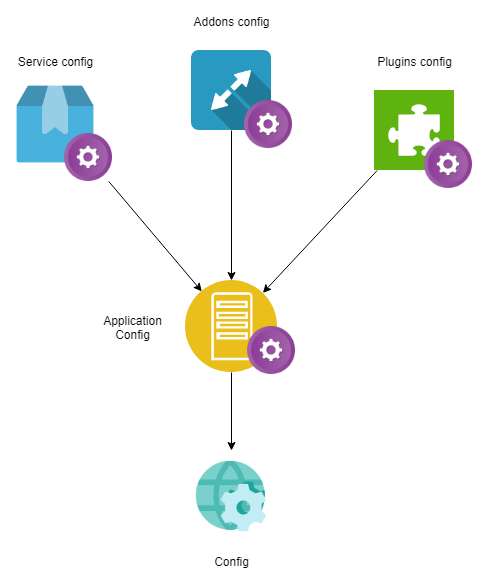

# Config File



## Why ?

* Easy to customize modules
* Flexible and versatile
* Easy to learn and easy to use
* Allow inheritance
* Support deep reference
* Support internal reference
* Support external reference
* Support value lock

## Classify

The config can be divided into two categories by level: `Module Level` and `Application Level`

### Module Level

#### 1. Services config

```text
service-name
  ├── controller/
  ├── model/
  ├── index.js
  ├── router.js
  └── appcfg.yaml
```



```yaml
page_size: 20
filter:
  - age
  - location
```



Service config can be accessed by the `this.$config` variable



```javascript
getUsers(){
    var {page_size, filter} = this.$config;
    ...
}
```



```javascript
function(app, cfg){
    var {page_size, filter} = this.$config;
    ...
}
```



#### 2. Plugins config

```text
plugin-name
  ├── src/
  ├── lib/
  ├── index.js
  ├── hyron-plugin.js
  └── appcfg.yaml
```



```yaml
private_key: 123456
```





```javascript
function handler(req, res, prev, cfg){
    var {private_key} = cfg;
    ...
}
```



#### 3. Addons config

```text
addon-name
  ├── src/
  ├── lib/
  ├── index.js
  ├── hyron-addon.js
  └── appcfg.yaml
```



```yaml
email: thangphung.work@gmail.com
```



```text
function handler(cfg){
    var {private_key} = cfg;
    ...
}
```

### Application Level

```text
root
  ├── services/
  ├── addons/
  ├── plugins/
  ├── res/
  ├── server/
  ├── public/
  ├── index.js
  ├── package.json
  └── appcfg.yaml
```



```yaml
public_key: ahihi123
app_name: myApp
```



## Features

### 1. Lock field

To prevent inheriting a field, add '$' before the name of the field. For example



```yaml
$private_key: 123456
```



### 2. Deep reference

To access a deep field in a parent field. For example



```yaml
schema:
  accounts:
    email: string
    password: string
```





```javascript
const {getConfig} = require("hyron");

module.exports = function(cfg){
    var accountModel = getConfig("schema.accounts", {});
}
```



### 3. Internal reference

The value of a field in appcfg can be  **referenced**  to another field. For example



```yaml
key1:
  child1: hello

key2: <#key1.child1> # hello
```



### 4. External reference

The value of a field in appcfg can be  **referenced externally**  by another `yaml` file



```yaml
email: string
password: string
```





```yaml
schema:
  account: <~models/account.yaml>
```



### 5. Allow inheritance

`appcfg.yaml` in  **Application Level**  can override the config from the config in  **Module Level**  by identifying the module \(declared in the build file\)



```yaml
service_name:
  page_size: 50
  
addons_name:
  email: hyron.dev@gmail.com

plugins_name:
  private_key: abc123
```



