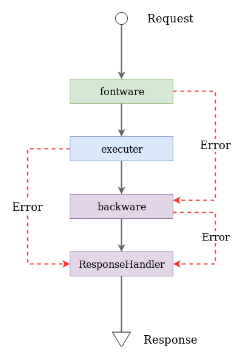

# Create Plugins


## Why ?

1. Easy to **Manage**
2. **Easy to Use**
3. Easy to **Reuse**
4. Easy to **Upgrade** and **Maintain**
5. **Focus** **more** on processing **Logic**

## Usage

### 1. Initialization plugins



```text
hyron init plugins
```





```text
plugin-name
  ├── lib/              - contains reusable code sections
  ├── src/              - contains the main processing code
  ├── index.js          - contains interfaces for use like a library
  ├── hyron-plugin.js   - contains interfaces for use by Hyron to register to the plugins
  ├── appcfg.yaml       - contains the configuration used for this plugin
  ├── package.json      - contains the basic information of this plugins used for the npm registry
  └── readme.md         - contains descriptions for this plugin
```



### 2. Create plugins interface

**Plugins** are part of the **I/O layer** made up by

* **frontware** : is middleware that it **runs in front** of [executer](create-services.md#2-define-controller)
* **backware** : is middleware that **runs behind** of [executer](create-services.md#2-define-controller)



A plugins may be missing **`frontware`** or **`backware`**


To pack a plugins, you only need to export the middleware



```javascript
// it was created by default
module.exports = {
    frontware : require('./src/frontware'),
    backware : require('./src/backware')
}
```



### 3. Create Middleware

A middleware is operated by two main methods: **handle** and **onCreate**

```javascript
module.exports = {
    handle(req, res, prev, cfg){
        console.log(req.headers)
        return prev;
    },
    global : true
}
```

Here are some properties that will be used in **frontware**, **backware**. see more [PluginsMeta](api-reference/pluginsmeta.md), [Middleware](api-reference/middleware.md)

| Properties | Type | Descriptions |
| :--- | :--- | :--- |
| handle\(req,res,prev,cfg\) | function | function that can be called before or after executer |
| checkout \(cfg\) | function | used to recall onCreate if returns true |
| onCreate \(cfg\) | function | call for the first time when a router is called |
| typeFilter | Array&lt;any&gt; | use to filter the data type of prev. Commonly used by backware |
| global | boolean | Automatically run on all routers if true |

#### 3.2 Workflow



* With **`frontware`**: the `prev` \(Array&lt;any&gt;\) parameter is the sum of the **results from the previous frontware**, **used as executer input**
* With **`backware`**: the `prev` \(any\) parameter is a combination of r**esults from previous backware** starting **from executer**, **used to handle the output** before returning the client
* Plugins can **communicate with each other**, and with executer via the [`this`](api-reference/hyronservice.md) variable
* You can use **Error to break** from the main **workflow**. with a default class is [HTTPMessage](ecosystem/library/httpmessage.md)

Example : `simple-auth` plugins is used to validate user access when requesting



```javascript
// authenticate plugin using jwt
const jwt = require("jsonwebtoken");
const cookie = require("cookie");
const SECRET_KEY = require("hyron").getConfig("secret");

function handle(req, res, prev, cfg) {
    try {
        var cookies = req.headers.cookie;
        var {access_token} = cookie.parse(cookies);
        var payload = jwt.verify(access_token, SECRET_KEY);

        var argIndex = this.$argsList.indexOf('uid'); // provided by param_parser plugin
        if(argIndex !== -1){
            prev[argIndex] = payload.uid;
        }
    } catch (err) {
        throw new HTTPMessage(
            StatusCode.UN_AUTHORIZED,
            "auth error, invalid token")
        );
    }
    return prev;
};

module.exports = {
    handle,
    global: true
}
```



```javascript
const cookie = require("cookie");
const jwt = require("jsonwebtoken");
const SECRET_KEY = require("hyron").getConfig("secret_key");

async function handle(req, res, prev, cfg) {
    if (prev == null) {
        res.setHeader(
            "Set-Cookie",
            cookie.serialize("access_token", null, {
                path: "/"
            })
        );
    } else {
        var accessToken = jwt.sign({
            prev
        }, SECRET_KEY);
        res.setHeader(
            "Set-Cookie",
            cookie.serialize("access_token", accessToken, {
                path: "/"
            })
        );
    }
    return true;
};

module.exports = {
    handle
}
```



### 4. Using plugins

Just like other modules, you need to declare in the json build file to use



```javascript
{
    "base_url": "http://localhost:3000",
    "plugins": {
        "simple-auth" : "./plugins/auth"
    },
    "services": {
        "storage": "./services/storage/router.js"
    }
}
```





```javascript
const fs = require('fs');

module.exports = class {
    static requestConfig() {
        return {
            upload: 'post',
            download: {
                method: 'get',
                params: '/:id',
                frontware: ['!simple-auth'] // to disable authenticate
            }
        }
    }

    // upload file from client. required authenticate
    upload(uid, name, file) {
        return new Promise((resolve, reject) => {
            fs.writeFile(`./.upload/${uid}-${name}`,
                file.content,
                (err) => {
                    if (err) {
                        reject(
                            new HTTPMessage(
                                StatusCode.INTERNAL_SERVER_ERROR,
                                `can't upload file because : ${err.message}`
                            )
                        );
                    } else resolve(true);
                });
        })

    }

    // download file from client. not required authenticate
    download(id) {
        return new Promise((resolve, reject) => {
            fs.readFile(`./.upload/${id}`, (err, data) => {
                if (err) {
                    reject(new HTTPMessage(
                        StatusCode.NOT_FOUND,
                        `not found file : ${err.message}`
                    ))
                } else resolve(data);
            })
        })
    }
}
```




The package of the Hyron organization can be loaded automatically without declaring for use. Let join us


