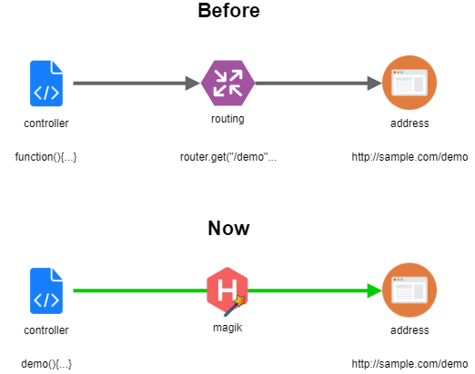

# Create Services


Hyron encourages you to build [Microservice Architecture](https://microservices.io/) applications that bring great benefits to your application




## Why ?

* Easy to expand
* Easy to understand
* Easy to reuse

## Usage

### Initialization service



```bash
hyron init services
```





```text
service-name
  ├── controller/     - contain processing logic for this service
  ├── model/          - contain contains data models, methods for communicating with the database
  ├── index.js        - contains interfaces for use by other services
  ├── router.js       - contains interfaces for use by Hyron to register to the service
  ├── appcfg.yaml     - contains the configuration used for this service
  ├── package.json    - contains the basic information of this service used for the npm registry
  └── readme.md       - contains descriptions for this service
```




