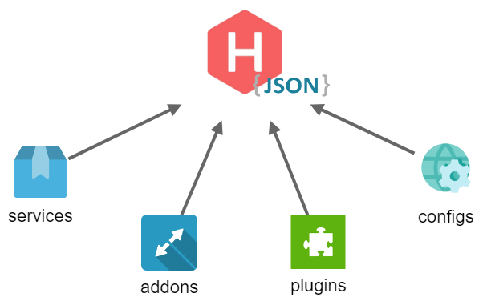

# JSON Build File



## Why ?

* Easy to grasp general
* Easy to use
* Support external reference
* Automatically install missing packages

## Usage

A json build file contains information about an instance



```scheme
{
    "base_url": "http://localhost:3000",
    "services": {
        "account": "services/account/router.js",
        "user": "services/user/router.js",
    }
}
```



#### Supported field

| Field | Type | Description |
| :--- | :--- | :--- |
| base\_url | string | Set the base url for this instance |
| server | object | Contains server information, including: `host`, `port`, `protocol`, `prefix` |
| setting | object | Contains settings for this instance |
| addons | object | Contains list of addons enabled |
| plugins | object | Contains list of plugins enabled |
| services | object | Contains list of services enabled |

#### Run application

You can use these files to run the application with the cli tools or with the hyron package



```bash
hyron start [path]
```



```javascript
const hyron = require("hyron");
hyron.build("/server/app.json"); // path to json build file
```



## Features

### 1. External reference

To run multiple instances, you can use an array containing its paths. For example

```text
server
  ├── myApp.json
  ├── otherApp.json
  └── app.json
```



```scheme
[
    "server/myApp.json",
    "server/otherApp.json"
]
```



### 2. Global addons

To declare global instances that can be run automatically on each instance. Add an empty instance containing only the `addons` as follows



```scheme
[   
    "server/global-addons.json",
    "server/myApp.json",
    "server/otherApp.json"
]
```



```scheme
{
    "addons" : {
        "java_driver" : "@hyron/java-supporter"
    }
}
```



### 3. Automatically install missing packages

JSON build file will automatically detect and install missing packages using the [yarn engine](https://yarnpkg.com/en/docs/cli/add).



```scheme
{
    "base_url": "http://localhost:3000",
    "plugins": {
        // install from npm registry
        "from-npm": "npm-package-name",
        
        // install from github
        "from-git": "https://github.com/user/package.git",
        
        // install from local file
        "from-local" : "file:/path/to/local/folder",
        
        // install from local package
        "from-pack" : "file:/path/to/local/tarball.tgz",

        // install from remote url
        "from-remote" : "https://my-project.org/package.tgz",

        ...
    }
}
```



Hyron supports parallel installation \(plugins, addons, services\) to help speed up the installation

If the packages were successfully installed, Hyron will ignore it during the next run


Note: Name the module the same as the package-name to support most cases


