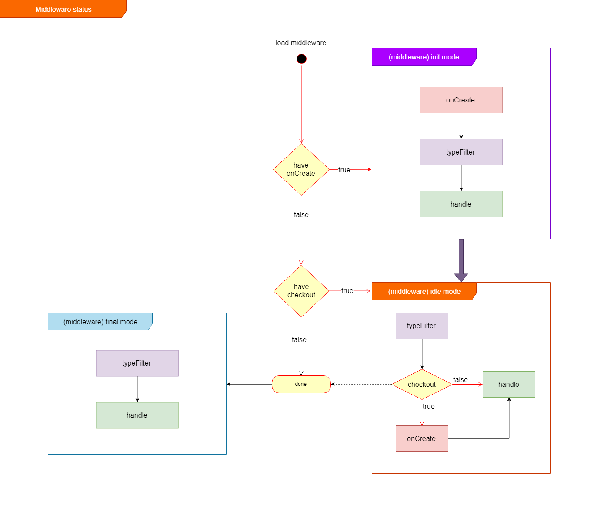

Can be said, Hyron is a framework based on plugins. The main power of Hyron is actually largely based on external modules, such as plugins

First of all, let's learn a little bit about the concept, and why using plugins is essential.

# What is plugins ?

> ### Plugins are a module that can be used to handle input and output for a router

# Structure of a plugins ?

> ### A plugins based on 2 parts, fontware and backware

# What is a fontware ?

> ### fontware is a middleware running in front of main-hander (is a function that processing business logic), used to process input for main-handler

# What is a backware ?

> ### backware is a middleware running in back of main-hander, used to process output of main-handler

# So, what a plugins look like ?

This is a diagram about a plugins

Like you see, a plugins include at lest one part : fontware or backware or a both

Each middleware contains functions defined for itself as :

-   **handle** ( req, res, prev, cfg ) : contain a function that can be called each time a request to target router have make
-   **onCreate** ( cfg ) : a function that could be called for the first time to init values
-   **checkout** ( done, cfg ) : a function that could be to used to revoke onCreate if have any change
-   **typeFilter** : decide whether this middleware is executed by checking the type of prev
-   **global** : decide whether the middleware is automatically called for each router or not

You can see [PluginsMeta reference](/api-reference/PluginsMeta.md) to find more about a plugins

# Why we use plugins ?

-   It's easy to reuse and share
-   It helps separate the IO processing block from logic processing, makes it easy to reuse the logic block, test and fix errors, and your code becomes more concise.
-   Can take advantage of help from the community through their push-up plugins
-   It makes it easy to monitor and manage source code

# How can i custom a plugins ?

In addition to modifying the code in the same way as the traditional way, Hyron provides a solution that allows you to customize a plugins from 3rd parties through appcfg.yaml

appcfg is a special file that contains variables and settings for your modules and projects.
With override mechanism, lock field of appcfg.yaml. You can change the value of configuration properties to custom that plugins

But you should also note, you need to build a plugins so that they can be customized by other users. and the settings or processing should be cached and optimized to achieve the highest performance

You can use the following methods to access the config :

-   args cfg at last argument of onCreate, checkout, handle
-   Use Hyron.**getConfig** ( pluginsName, defaultValue )

# How to deploy my plugins ?

At the present time, we have not provided features to support deploying and sharing. We will try to release this feature as soon as possible to serve the community

You also use another service to resolve this problem like

-   [npm registry](https://www.npmjs.com/)
-   [github](https://github.com/)
-   [bitsrc](https://bitsrc.io/)

# Do Hyron supports asynchronous plugins ?

Yes, so are all other ingredients, includes both of async/await and Promise

# I have many plugins, how will the plugins run ?

You can refer to the life of a router :

As you can see, the plugins will run sequentially, the value of the previous plugins will be used as the input value for the following plugins (via variables prev)

If a middleware throws an exception (it is possible to throw if it is a normal function, or promise reject if it is an asynchronous method).
in the case of a fontware, it will ignore any subsequent middleware, and the main-handler to jump directly to the backware.
in the case of backware, it will jump to the reponse-handler (which is the default function of Hyron to handle default response, it is res.end but extension for handle data type, error, async, etc)

This mechanism allows plugins to be flexible, even inheriting each other to solve a problem. You should also pay attention to their order

# State of middleware ?

Hyron uses state control mechanisms, which allow optimal function to run down to the smallest level, minimizing the time delay when a plugins are called.

Note: if typeFilter is not set, it will skip this step for optimization

As you can see, if the plugins are called for the first time of this instance, if the onCreate event is declared, it will run this event first in the **Init State**.

After the call is complete, it will switch to **IDLE State** to wait for changes from checkout or will move to **Final State** with the most streamlined processing functions if checkout is not set

**Final State** can also be set if you call parameter done (args index 0 of checkout)

# I heard that i can access this variable from the router. Is that true ?

Yes, plugins and main handlers share a this variable (run in sandbox) and you can use them to share information between plugins, or with main-handle. Hyron allows some default fields like

-   **\$eventName** : event name of this router
-   **\$executer** : is main-handler function of this router
-   **\$requestConfig** : Installation information for this router
-   **\$config** : contain this service config

# Can I run my plugins without being declared ?

Yes, you can. By becoming a member of Hyron organization, your package under @hyron scope if declared in appcfg will be able to be run automatically without requiring the user to declare it.

This is a great privilege. It allows your package to be much more convenient, and can be used as a third library

# Why is the package of Hyron organization preferred ?

Its package will be better moderated, so it is more reliable than other regular packages. In addition, you can also register to become developer with benefits like get help, rewards and other benefits from Hyron developer community. See more at [developer policies]()
