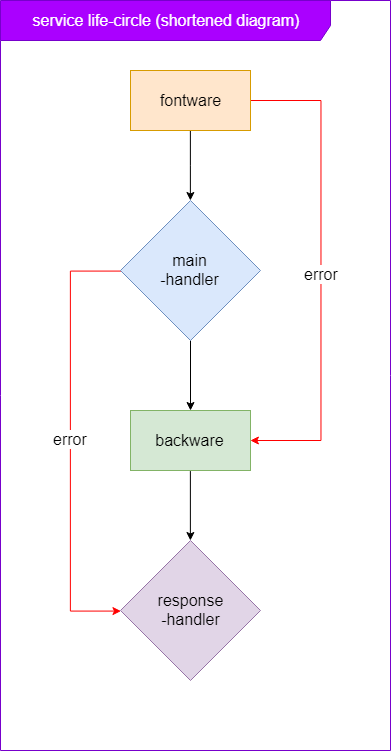

# Concept

## What is Service ?

> ### Service is a group of functions used to handle a specific business logic

## What is Micro-Service ?

> ### microservice is an application programming architecture that focuses on separating application features into the smallest processing services

## Why should I build on the micro-service architecture ?

Design your app used micro-service architecture gives you a lot of advantages compared to developing applications in monolithic architecture

We can mention the main advantages

-   Easy to develop
-   Easy to scale-up
-   Easy to reuse code
-   Easy testing
-   Easy to development
-   Easy to apply development processes

## Can i develop according to my wishes ?

Yes, you can, microservice is just an option, you can choose another architecture that is more suitable for your project, which is optional, and you can do it with your

## The main points of a service ?

-   A service should have own database model
-   A service should be a blackbox, to communicate with the service through an interface
-   A service should only solve a single business logic
-   A service can be called by both the client and server
-   A service can be configured from the outside

## What makes hyron a good choice for microservice application development ?

-   Hyron helps your service be packed more standard
-   Hyron makes managing and configuring services easier
-   Hyron can help you reuse the higher level modules

## I heard that building a service in hyron is very simple, isn't it?

Yes, with the help of plugins, you can almost build a service just need to know a little bit about javascript.

Example : Below is a section of BookManagerService

./services/books/controller/BookManager.js

```js
// used mongoose model
const BookModel = require('../model/books');

module.exports = class BookManager {

    static requestConfig(){
        return {
            listBook : "get"
        }
    }

    async listBook(category){
        // find book by category in mongo database
        var booksList = await BookModel.find({
            category_id : category
        });

        if(booksList==null){
            // throw a Exception that return 404 (not found) to client
            throw new HTTPMessage(
                StatusCode.NOT_FOUND,
                "There are no books in this category")
        } else {
            return booksList;
        }
    }

    ...
}
```

./services/books/router.js

```js
module.export = require("./controller/BookManager");
```

./server.js

```js
const hyron = require("hyron");

var demoApp = hyron.getInstance(3001);

demoApp.enableService({
    books: "./services/books/router.js"
});

demoApp.startServer();

// you also used json file to build & run app instead code abort
```

### **Result**

a router register on

```http
GET http://localhost:3001/books/listBook?category=[cateId]
```

As you can see, it is very simple, you just need to write the logic handling code and declare it, that you can create a router

You can even do more than that. You can install plugins from 3rd party, or even a service, you can easily plug it into your application with Hyron.

# How Hyron Service work ?




