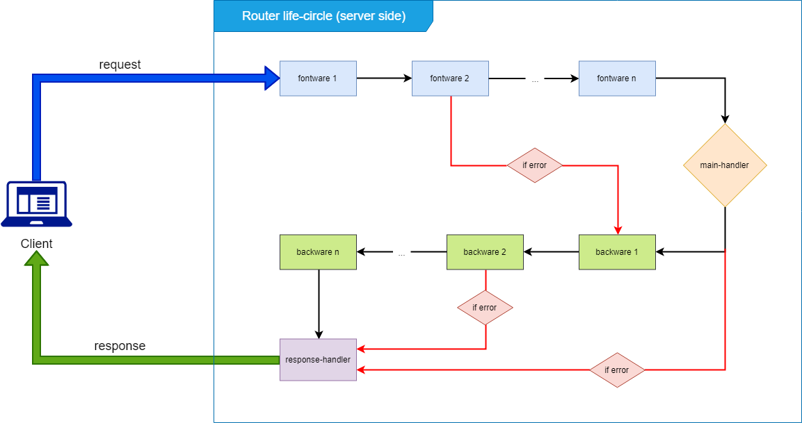

# What is Service ?

> ### Service is a group of functions used to handle a specific business logic

# What is Micro-Service ?

> ### microservice is an application programming architecture that focuses on separating application features into the smallest processing services

# Why should I build on the micro-service architecture ?

Design your app used micro-service architecture gives you a lot of advantages compared to developing applications in monolithic architecture

We can mention the main advantages

-   Easy to develop
-   Easy to scale-up
-   Easy to reuse code
-   Easy testing
-   Easy to development
-   Easy to apply development processes

# Can i develop according to my wishes ?

Yes, you can, microservice is just an option, you can choose another architecture that is more suitable for your project, which is optional, and you can do it with your

# The main points of a service ?

-   A service should have own database model
-   A service should be a blackbox, to communicate with the service through an interface
-   A service should only solve a single business logic
-   A service can be called by both the client and server
-   A service can be configured from the outside

# What makes hyron a good choice for microservice application development ?

-   Hyron helps your service be packed more standard
-   Hyron makes managing and configuring services easier
-   Hyron can help you reuse the higher level modules

# I heard that building a service in hyron is very simple, isn't it?

Yes, with the help of plugins, you can almost build a service just need to know a little bit about javascript.

Example : Below is a section of BookManagerService

./services/books/controller/BookManager.js

```js
// used mongoose model
const BookModel = require('../model/books');

module.exports = class BookManager {

    static requestConfig(){
        return {
            listBook : "get"
        }
    }

    async listBook(category){
        // find book by category in mongo database
        var booksList = await BookModel.find({
            category_id : category
        });

        if(booksList==null){
            // throw a Exception that return 404 (not found) to client
            throw new HTTPMessage(
                StatusCode.NOT_FOUND,
                "There are no books in this category")
        } else {
            return booksList;
        }
    }

    ...
}
```

./services/books/router.js

```js
module.export = require("./controller/BookManager");
```

./server.js

```js
const hyron = require("hyron");

var demoApp = hyron.getInstance(3001);

demoApp.enableService({
    books: "./services/books/router.js"
});

demoApp.startServer();

// you also used json file to build & run app instead code abort
```

### **Result**

a router register on

```http
GET http://localhost:3001/books/listBook?category=[cateId]
```

As you can see, it is very simple, you just need to write the logic handling code and declare it, that you can create a router

You can even do more than that. You can install plugins from 3rd party, or even a service, you can easily plug it into your application with Hyron.

# How Hyron Service work ?

Below is a general operation diagram of a hyron service


As you can see, hyron splits a listenter router into two separate layers, namely the IO layer (including fontware and backware), and the logical layer (the main-handler). Instead of aggregating them as the way most other frameworks do

This will help your source code not only be much shorter than the classic method, it also makes it easier for you to grow. Thanks to this packaging advantage, you can easily **share** them with other team members, in the company, or with your various projects, or even with the community.

The following is a detailed activity diagram, describing how plugins operate, and how they communicate with each other and with main-handler.



As you can see, the plugins will be run sequentially to handle each time a new request is received (via an API gateway to manage the routers).

Any pre-declared plugins will run first. And the results of the previous plugins will be used as input of the following plugins

A plugin includes fontware to handle input and backware to handle output, you can see more about them [here](../plugins-development/README.md)

For a fontware, when it throws an exception, it will jump to the backware without going through the main-handler

For a backware, when it throws an exception, it will ignore the remaining backware and jump to the response handler and return the result to the client.

You can also always return the client from the plugins

# How to community bettween router component ?

Components in a router such as plugins, and main-handlers can communicate with each other in two ways

1. **Use argument and return** : The result of a previous component will be used as the input of the following component
2. **Through this scope** : components in the same router can share resources for each other, and are limited to one sandbox

About the first way, as you can see [above](#How-Hyron-Service-work), we will go deeper into the second way through the ``this`` variable


As you can see, ``this`` variable can be shared in the same router. They run in the same sandbox, so you can access resources in this space

however, they still need to be followed in order. This means the following declared plugins can only receive parameters passed from the previously declared plugins. So we can summarize

- **main-handler** can only take parameters from **fontware** through this
- **backware** can get parameters from **main-handler** and **fontware** though this

This router's scope can also be inherited from service this scope in case routers are declared in the same class

Example :

```js
class MyService {
    static requestConfig(){...}

    getImage(id){...}

    listImage(targetId){
        ...
        // reference to abort method
        this.getImage(id);
    }
}
```

Since routers are run in a sandbox, it can only inherit properties from the service instance without modifying them.

In addition to using methods in the class, it can also access the router's config via [$config](../api-reference/HyronService.md#var-config) and config of the router itself via [\$requestConfig](../api-reference/RouterMeta.md)