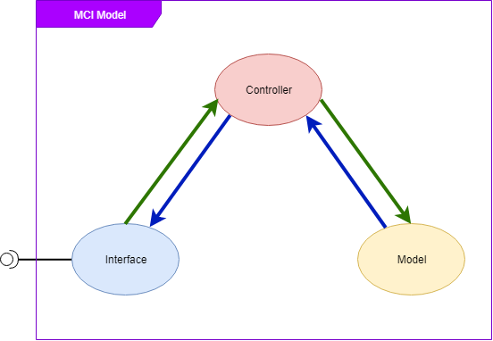

## Step 1 : Create Service Structure

To make your service easy to reuse, maintain and upgrade, you should write your services under micro-service architecture. If you haven't worked with microservice yet, don't worry, hyron can help you easily to implement it. You should also refer to the microservice online course, or application programming instructions for more knowledge about it.

The following is a reference architecture to build a service according to microservice architecture

### Folder Structure

```
services
  |-- service_name
        |-- controller
        |-- model
        |-- router.js
        |-- index.js
        |-- appcfg.ini
```

Each service is like a small application, to handle a specific business. Therefore, it should also follow a programming architecture to help you source code more clearly.

Specifically, you should apply the **MCI architecture** for your service

MCI (model-controller-interface) is a variant of **MVC**, which separates processing logic, data models, and interfaces to interact with other services into independent parts. This makes your application easily manageable, easy to upgrade, maintain, and edit

### MCI consists of 3 main components :



- **Model** : contains sections that interact with the database, the interface to store the file, or define a model to store data
- **Controller** : contains processing logic for this service, controllers interact with the model to retrieve data and process them based on them
- **Interface**: contains interfaces (loose) to help interact with other services (via index.js), and with hyron (via router.js)

### Rule :

- A service like a black box, other services that want to communicate with it need to go through the interface layer
- The interface layer needs to aggregate the necessary methods defined based on the behavior of that service

## Step 2 : Define Model

Before starting any application, the first step should be to analyze and design the data that will be used in this service.

In the ``model`` file, where the Schema defines the data type, the model will be stored in the database, initialize for db, or methods that can be used to interact with the database

### Example :

Below is a model to handle student management, used [mongoose](https://mongoosejs.com/)
This service is responsible for processing information about a student

./models/StudentsInfo
```js
const {model, Schema} = require('mongoose');

var studentSchema = new Schema({
    name : String,
    class : Schema.ObjectId,
    strength : [String],
    weakness : [String],
    height : Number,
    weight : Number
});

studentSchema.index({name: 'text'});

module.exports = new model("student_info", studentSchema);
```

As you can see, this model is only responsible for processing information about a student, and exporting a model that can be used to interact with the database.

➜ **Fact** : mongodb is a popular non-link database management system (noSQL), it can work with json, or JSObject with high speed, and discrete data. It is quite friendly with nodejs

## Step 3 : Write Controller ( business logic )

As you know, **controllers** are an important part of a service, which is used to define how that service works

The service will receive data from the model, and process the data in some way depending on the service feature provided to your project.

### Example : 

Continuing with the above student management example, the controller will be a class that helps define queries and handle students.

➜ **Fact** : Hyron makes a friendly combination between a router can be explored by the client with logic processing functions. Therefore, you can declare a short function to describe the functions that will be registered to become the router in the controller. This will help you be able to control them easily, and can be well supported by your IDE

➜ **Fact** : hyron helps you to pack in a friendly way, especially those who are familiar with Java, C family, or other object-oriented programming languages

➜ **Fact** : Hyron recommends that you use the syntax of [ES6](http://es6-features.org/#Constants), it's quite friendly, short, easy to learn. However, you can use other versions if you want

./controller/StudentManager.js
```js
const StudentModel = require('../model')
module.exports = class StudentManager {
    
    // a function that used by hyron to register router
    static requestConfig(){
        return {
            addStudent : "post",
            deleteStudent : {
                method : "delete",
                params : "/:sid"
            },
            search : {
                method : "get",
                params : "/:name"
            }

        }
    }

    // add student by student info
    async addStudent(info){
        var newStudent = new StudentModel(info);
        await newStudent.save((err)=>{
            throw new HTTPMessage(
                StatusCode.INTERNAL_SERVER_ERROR,
                "can't add student for error : "+err.message
                )
        })
        return true;
    }

    // delete student by student id (_id field)
    async deleteStudent(sid){
        await StudentModel
        .findByIdAndDelete(sid)
        .exec((err)=>{
            throw new HTTPMessage(
                StatusCode.NOT_FOUND,
                "can't find student with id : "+sid
                )
        });
        return true;
    }

    // search student by name
    async search(name, filter, sort){
        return await StudentModel.find({
            $text : {$search : name},
            ...filter
        }).sort(sort).exec();
    }
}
```

In fact, you don't need to build everything in the same js file. If your source code is large, you can completely separate them into separate files (if your code is longer than 200 lines), separating them will make it easier to maintain later.

You also don't need to define the ``requestConfig`` function, however, it is a good choice if your code is short

## Step 4 : write interface

The interface is like a loose coupling, through which services can interact with each other, like a normal library.

The interface is like a loose coupling, through which services can interact with each other, like a normal library.

### **1. Used to communicate with hyron** : 
> contains the requestConfig function and possibly the accompanying processing functions, used to describe the routers that will be used to register the router.
> It is usually contained in the router.js file

### **2. Used to communicate with other services**
> is the combination of controller functions that can be used by other services
> It is usually contained in the index.js file

First of all, let's start with type 1. 

In order to register routers, the router needs to know the information about that router, you can provide this information through the [requestConfig](../api-reference/HyronService.md) method.

### Example :

./router.js
```js
module.exports = require('./controller/StudentManager');
```

If you have declared the ``requestConfig`` before, the rest of the job is quite simple, just point the router to the controller

In case the code is too long and you have separated the handlers into individual files, you can still declare them in this file, and used 'handle' properties to assign a main-handler Instead of the enclosed handler

### Example 2 :

./router.js
```js
module.exports = {
    static requestConfig(){
        return {
            addStudent : {
                method : "post",
                // used handle attribute to declare handler for this router
                handle : require('./controller/addStudent')
                },
            deleteStudent : {
                method : "delete",
                params : "/:sid",
                handle : require('./controller/deleteStudent')

            },
            search : {
                method : "get",
                params : "/:name",
                handle : require('./controller/search')
            }

        }
    }
}
```

➜ **Fact** : By default, the hyron will configure the router address based on the module_name + method_name. however, you can also customize it, using the 'path' attribute